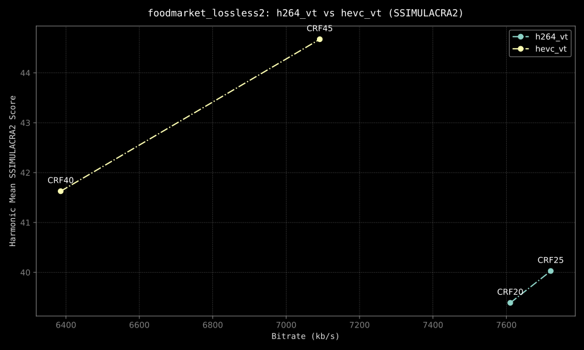

# bdr-ssimu2

Encode, analyze, & plot SSIMULACRA2 scores using a source video file that is
encoded with FFmpeg.

This Python script generates BD-Rate (Bjøntegaard-Delta Rate) graphs for
comparing the performance of different encoding commands. It encodes a source
video with various specified Constant Rate Factor (CRF) values, calculates
SSIMULACRA2 scores, and plots the results via `matplotlib`.

## Features

- Encodes a source video using two user-configurable FFmpeg commands
- Calculates SSIMULACRA2 scores (and soon XPSNR scores as well)
- Generates BD-Rate curves comparing the two encoding commands
- Outputs both average and harmonic mean SSIMULACRA2 plots in a user-specified
  image format
- Allows for temporal metric analysis subsampling (sampling every nth frame)

## Prerequisites

- Python 3.x
- FFmpeg
- VapourSynth with:
  - [VSZip Plugin](https://github.com/dnjulek/vapoursynth-zip)
  - FFMS2
- Required Python packages (included in header):
  - `vapoursynth`
  - `matplotlib`
  - `tqdm`

## Installation

1. Clone this repository or download the script (`bdr-ssimu2.py`) to your local
   machine.

2. Install `uv`:

```bash
# On macOS and Linux.
curl -LsSf https://astral.sh/uv/install.sh | sh
```

3. Install necessary Vapoursynth dependencies via your favorite package manager
   or by building from source.

4. Build & install the SSIMULACRA2 Zig Plugin:

```bash
git clone https://github.com/dnjulek/vapoursynth-ssimulacra2
cd vapoursynth-ssimulacra2
./build.sh
```

4. Ensure FFmpeg and VapourSynth are installed & accessible from the command
   line. This may involve creating a `/usr/local/lib/vapoursynth` directory &
   symlinking the necessary libraries into it.

5. Mark the script as executable:

```bash
chmod a+x bdr-ssimu2.py
```

6. Run the script, which will install its own dependencies:

```bash
Installed 13 packages in 55ms
usage: bdr-ssimu2.py [-h] [-cs1 CRF_START_1] [-ce1 CRF_END_1] [-ct1 CRF_STEP_1] [-cs2 CRF_START_2] [-ce2 CRF_END_2] [-ct2 CRF_STEP_2] [-e EVERY] [-t THREADS] [-f FORMAT] source
bdr-ssimu2.py: error: the following arguments are required: source
```

## Usage

```
usage: bdr-ssimu2.py [-h] [-cs1 CRF_START_1] [-ce1 CRF_END_1] [-ct1 CRF_STEP_1] [-cs2 CRF_START_2] [-ce2 CRF_END_2] [-ct2 CRF_STEP_2] [-e EVERY] [-t THREADS] [-f FORMAT] source

Encode, analyze, and plot SSIMULACRA2 scores using a source video file that is encoded with FFmpeg.

positional arguments:
  source                Source video path

options:
  -h, --help            show this help message and exit
  -cs1 CRF_START_1, --crf_start_1 CRF_START_1
                        Starting CRF value (first codec). Default 15
  -ce1 CRF_END_1, --crf_end_1 CRF_END_1
                        Ending CRF value (first codec). Default 30
  -ct1 CRF_STEP_1, --crf_step_1 CRF_STEP_1
                        CRF step size (first codec). Default 5
  -cs2 CRF_START_2, --crf_start_2 CRF_START_2
                        Starting CRF value (second codec). Default 15
  -ce2 CRF_END_2, --crf_end_2 CRF_END_2
                        Ending CRF value (second codec). Default 30
  -ct2 CRF_STEP_2, --crf_step_2 CRF_STEP_2
                        CRF step size (second codec). Default 5
  -e EVERY, --every EVERY
                        Only score every nth frame. Default 1 (every frame)
  -t THREADS, --threads THREADS
                        Number of threads. Default 0 (auto)
  -f FORMAT, --format FORMAT
                        Save to format webp, png, svg. Default svg
```

### Example

Example command:

```bash
./bd_rate_graph.py input_video.m4v -cs1 18 -ce1 30 -ct1 3 -cs2 18 -ce2 30 -ct2 3 -e 5
```

Example images: 


This command will analyze the input video, using CRF values from 18 to 30 with a
step of 3 for both codecs, and only score every 5th frame.

## Customizing Codec Commands

To use different codecs or encoding settings, modify the `ffmpeg_commands`
dictionary in the `main()` function. Replace the existing commands with your
desired FFmpeg commands, ensuring to keep the `{input}`, `{output}`, and `{crf}`
placeholders.

## Output

The script generates:

- Images of the BD-Rate curves in your desired format (one for average scores,
  one for harmonic mean scores)
- JSON files containing encoding commands & metrics output

Note: Harmonic Mean calculation for SSIMULACRA2 is currently a bit unusual,
since we have to factor in negative SSIMULACRA2 scores. I'll explain what I did
below, in case anyone wants to improve it or use it for their own purposes.

The harmonic mean (H) of a set of numbers is calculated using the formula:

```math
H = n / (∑(1/x_i))
```

Where `n` is the number of values and `x_i` represents each value in the
dataset.

Our harmonic mean calculation looks like this:

```python
harmonic_mean: float = len(positive_scores) / sum_reciprocals
```

In order to get here, we:

1. Put together a list of all of the _positive_ SSIMULACRA2 scores we recorded
2. Put together a list of all of the _negative_ SSIMULACRA2 scores we recorded
3. Calculated the sum of the reciprocals of the positive & negative scores
4. Subtract the sum of the reciprocals of the negative scores from the sum of
   the reciprocals of the positive scores, increasing the size of the
   denominator relative to the number of negative scores we have. This results
   in a smaller harmonic mean if we have more negative scores.
5. Divide the number of positive scores by the sum we calculated in step 4; we
   use the number of positive scores because this further penalizes the harmonic
   mean for having negative scores by minimizing the value of the numerator.

So, as a mathematical formula, we would have:

```math
H = \frac{|P|}{\sum_{i \in P} \frac{1}{x_i} - \sum_{j \in N} \frac{1}{x_j}}
```

Where: P = set of positive scores N = set of negative scores |P| = number of
positive scores

This doesn't have any real-world meaning, but it's a way to calculate a harmonic
mean when you have negative values in your dataset that brings the harmonic mean
closer to 0 as you add more negative values. So, if you see a really low
harmonic mean, check the standard "average" plot to see what's going on.

## Contributing

Feel free to fork this repository and submit pull requests with any improvements
or bug fixes!

## License

See the [LICENSE](LICENSE) file for details.

## Acknowledgements

Thank you to Rob Allen for showing me how `uv` [could be used with a shebang](https://akrabat.com/using-uv-as-your-shebang-line/), and how to [define Python dependencies at the top of the file](https://akrabat.com/defining-python-dependencies-at-the-top-of-the-file/).
