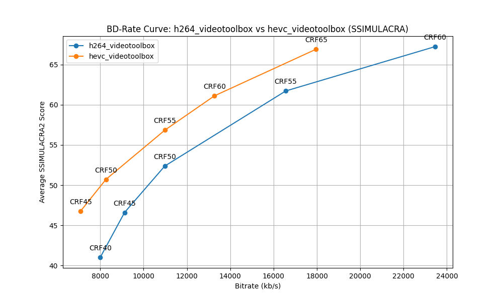
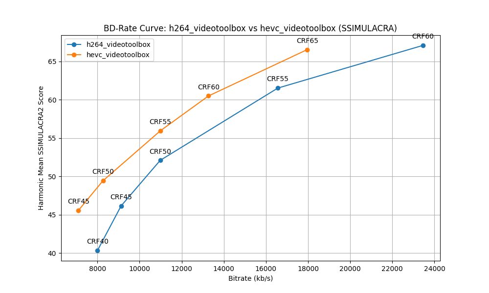

# bdr-ssimu2

Encode, analyze, & plot SSIMULACRA2 scores using a source video file that is encoded with FFmpeg.

This Python script generates BD-Rate (Bjøntegaard-Delta Rate) graphs for comparing the performance of different encoding commands. It encodes a source video with various specified Constant Rate Factor (CRF) values, calculates SSIMULACRA2 scores, and plots the results via `matplotlib`.

## Features

- Encodes a source video using two user-configurable FFmpeg commands
- Calculates SSIMULACRA2 scores (and soon XPSNR scores as well)
- Generates BD-Rate curves comparing the two encoding commands
- Outputs both average and harmonic mean SSIMULACRA2 plots
- Allows for temporal metric analysis subsampling (sampling every nth frame)

## Prerequisites

- Python 3.x
- FFmpeg
- VapourSynth with:
  - [VSZip Plugin](https://github.com/dnjulek/vapoursynth-zip)
  - FFMS2
  - fmtconv
- Required Python packages:
  - `vapoursynth`
  - `matplotlib`
  - `tqdm`

## Installation

1. Clone this repository or download the script (`bdr-ssimu2.py`) to your local machine.

2. Install the required Python packages as well as the necessary Vapoursynth dependencies:

```bash
pip install vapoursynth matplotlib tqdm
```
> Note: Install the necessary Vapoursynth dependencies using your favorite package manager or by building from source.

3. Build & install the SSIMULACRA2 Zig Plugin:

```bash
git clone https://github.com/dnjulek/vapoursynth-ssimulacra2
cd vapoursynth-ssimulacra2
./build.sh
```

4. Ensure FFmpeg and VapourSynth are installed and accessible from the command line. This may involve creating a `/usr/local/lib/vapoursynth` directory & simlinking the necessary libraries to it.

## Usage

```
usage: bdr-ssimu2.py [-h] [-cs1 CRF_START_1] [-ce1 CRF_END_1] [-ct1 CRF_STEP_1] [-cs2 CRF_START_2] [-ce2 CRF_END_2] [-ct2 CRF_STEP_2] [-e EVERY] [-t THREADS] source

Encode, analyze, and plot SSIMULACRA2 scores using a source video file that is encoded with FFmpeg.

positional arguments:
  source                Source video path

options:
  -h, --help            show this help message and exit
  -cs1 CRF_START_1, --crf_start_1 CRF_START_1
                        Starting CRF value (first codec). Default 15
  -ce1 CRF_END_1, --crf_end_1 CRF_END_1
                        Ending CRF value (first codec). Default 30
  -ct1 CRF_STEP_1, --crf_step_1 CRF_STEP_1
                        CRF step size (first codec). Default 5
  -cs2 CRF_START_2, --crf_start_2 CRF_START_2
                        Starting CRF value (second codec). Default 15
  -ce2 CRF_END_2, --crf_end_2 CRF_END_2
                        Ending CRF value (second codec). Default 30
  -ct2 CRF_STEP_2, --crf_step_2 CRF_STEP_2
                        CRF step size (second codec). Default 5
  -e EVERY, --every EVERY
                        Only score every nth frame. Default 1 (every frame)
  -t THREADS, --threads THREADS
                        Number of threads. Default 0 (auto)
```

### Example

Example command:
```
python bd_rate_graph.py input_video.mp4 -cs1 18 -ce1 30 -ct1 3 -cs2 18 -ce2 30 -ct2 3 -e 5
```

Example images:



This command will analyze the input video, using CRF values from 18 to 30 with a step of 3 for both codecs, and only score every 5th frame.

## Customizing Codec Commands

To use different codecs or encoding settings, modify the `ffmpeg_commands` dictionary in the `main()` function. Replace the existing commands with your desired FFmpeg commands, ensuring to keep the `{input}`, `{output}`, and `{crf}` placeholders.

## Output

The script generates:
- WebP images of the BD-Rate curves (one for average scores, one for harmonic mean scores)
- A JSON file containing detailed results

## Contributing

Feel free to fork this repository and submit pull requests with any improvements or bug fixes!

## License

See the [LICENSE](LICENSE) file for details.
